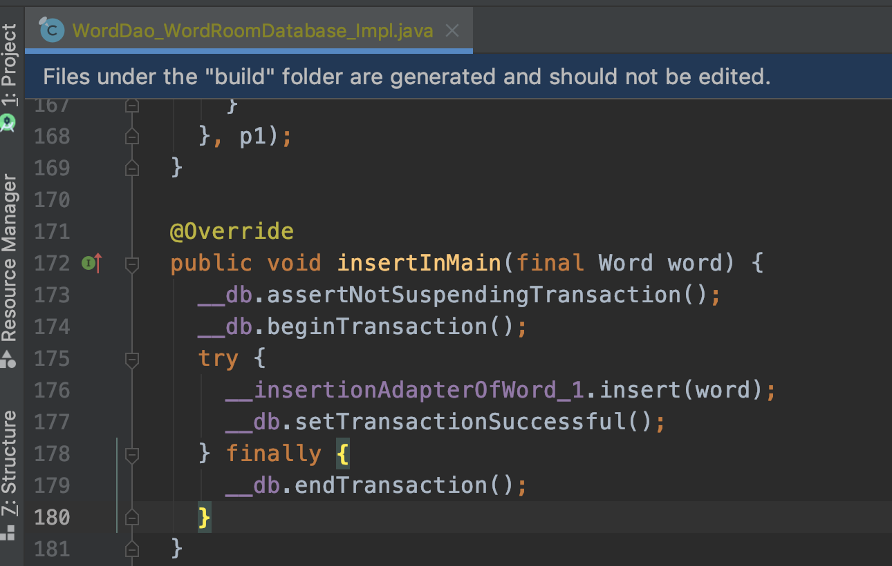

### ANR的分类


### 造成ANR的原因

1. 应用在主线程上进行长时间的计算。
2. 应用在主线程上执行耗时的I/O的操作。
3. 主线程处于阻塞状态，等待获取锁。
4. 主线程与其他线程之间发生死锁。
5. 主线程在对另一个进程进行同步 binder 调用，而后者需要很长时间才能返回。(如果我们知道调用远程方法需要很长时间，我们应该避免在主线程调用)

上述原因都会造成主线程被长时间阻塞，导致无法响应用户的操作，从而造成ANR。

注意：主线程做耗时操作本身是不会产生ANR的，导致ANR的根本还是应用程序无法在一定时间内响应用户的操作。因为主线程被耗时操作占用了，主线程无法对下一个操作进行响应才会ANR，没有需要响应的操作自然就不会产生ANR，或者应该这样说：主线程做耗时操作，非常容易引发ANR。

举个例子

比如说我发送一个广播，然后在广播接收器的onReceive方法（广播接收器的onReceive方法默认在主线程执行）里面睡眠一段时间，如果这个时候主线程没有任何操作了，那么广播接收器可以正常执行完毕。不会造成ANR。如果我在发送广播之后然后点击多次返回按键，这个时候因为主线程睡眠了，无法响应返回操作，就会造成ANR。


广播接收器类

```
public class MyReceiver extends BroadcastReceiver {

    private static final String TAG = "MyReceiver";

    @Override
    public void onReceive(Context context, Intent intent) {
        //这个方法运行在主线程中的，处理具体的逻辑
        Log.d(TAG, "onReceive: this is " + "in thread " + Thread.currentThread().getName());
        try {
            Thread.sleep(12000);
        } catch (InterruptedException e) {
            e.printStackTrace();
        }

        Toast.makeText(context.getApplicationContext(), "MyReceiver onReceive", Toast.LENGTH_SHORT).show();
        // abortBroadcast();
    }
}

```

MainActivity类部分代码

```
    public void onClick(View view) {
        sendGlobalBroadcast();
    }

    public void sendGlobalBroadcast() {
        Intent intent = new Intent();
        //设置前台广播的标志位
        intent.addFlags(Intent.FLAG_RECEIVER_FOREGROUND);
        intent.setAction(ACTION_FIRST);
        sendBroadcast(intent);
    }
```

接下来我们就依次模拟上述5中ANR场景，然后分析产生的Logcat和traces.txt文件。

### 应用在主线程上进行长时间的计算

```kotlin
//使用冒泡排序对一个大数组排序
private fun sortBigArray() {
    val currTime = System.currentTimeMillis()
    val random = IntArray(1000000)
    for (i in random.indices) {
        random[i] = (Math.random() * 10000000).toInt()
    }
    BubbleSort.sort(random)
    println("耗时" + (System.currentTimeMillis() - currTime) + "ms")
    for (i in random.indices) {
        println(random[i].toString())
    }
}
```
我们点击一个按钮调用sortBigArray()方法对一个大数组（100万）进行排序，然后点击几次返回键。

Logcat日志输出

```
//debug级别日志
2020-06-03 21:20:24.209 com.example.android.jetpackdemo I/art: Wrote stack traces to '/data/anr/traces.txt'
```

```
//error级别日志
2020-06-03 21:20:28.048 ? E/ActivityManager: ANR in com.example.android.jetpackdemo (com.example.android.jetpackdemo/.StartActivity)
    PID: 15564
    Reason: Input dispatching timed out (Waiting to send key event because the focused window has not finished processing all of the input events that were previously delivered to it.  Outbound queue length: 0.  Wait queue length: 2.)
    Load: 7.7 / 7.48 / 7.35
    CPU usage from 294322ms to 0ms ago (2020-06-03 21:15:29.817 to 2020-06-03 21:20:24.139):
      4.1% 2001/system_server: 3.1% user + 0.9% kernel / faults: 64102 minor 6 major
      3.3% 29428/adbd: 0.8% user + 2.4% kernel / faults: 131259 minor
      1.1% 508/logd: 0.5% user + 0.6% kernel / faults: 18 minor
      0.7% 2661/com.android.systemui: 0.6% user + 0.1% kernel / faults: 1648 minor 1 major
      0.7% 607/surfaceflinger: 0.4% user + 0.3% kernel / faults: 21 minor
      0.7% 24463/com.huawei.hwid.persistent: 0.6% user + 0% kernel / faults: 4650 minor 1 major
      0.5% 4018/com.huawei.android.launcher: 0.4% user + 0% kernel / faults: 16025 minor 3 major
      0.5% 24301/fingerprint_log: 0% user + 0.5% kernel
      0.4% 28932/com.huawei.appmarket: 0.3% user + 0% kernel / faults: 2526 minor
      0.3% 2823/com.huawei.systemmanager:service: 0.2% user + 0% kernel / faults: 4921 minor 9 major
      0.3% 4128/com.google.android.gms: 0.2% user + 0% kernel / faults: 12450 minor 1 major
      0.2% 6831/kworker/u16:5: 0% user + 0.2% kernel
      0.2% 837/imonitor: 0% user + 0.2% kernel
      0.2% 24305/logcat: 0.1% user + 0.1% kernel
      0.2% 24308/sleeplogcat: 0% user + 0.2% kernel
      0.2% 6556/kworker/u16:2: 0% user + 0.2% kernel
      0.2% 3069/com.huawei.powergenie: 0.1% user + 0% kernel / faults: 440 minor 1 major
      0.1% 344/cfinteractive: 0% user + 0.1% kernel
      0.1% 26895/kworker/4:2: 0% user + 0.1% kernel
      0.1% 624/mm-pp-dpps: 0% user + 0% kernel
      0.1% 12531/kworker/u16:7: 0% user + 0.1% kernel
      0.1% 26585/com.huawei.systemmanager: 0% user + 0% kernel / faults: 1777 minor
      0.1% 603/servicemanager: 0% user + 0% kernel
      0% 8339/kworker/2:1: 0% user + 0% kernel
      0% 27839/wpa_supplicant: 0% user + 0% kernel / faults: 1 minor
      0% 24394/com.huawei.hwid.core: 0% user + 0% kernel / faults: 1649 minor
      0% 5382/mdss_fb0: 0% user + 0% kernel
      0% 27503/kworker/3:0: 0% user + 0% kernel
      0% 602/powerlogd: 0% user + 0% kernel / faults: 2 minor
      0% 1065/com.huawei.health:DaemonService: 0% user + 0% kernel / faults: 463 minor
      0% 10/rcuop/0: 0% user + 0% kernel
      0% 350/mmc-cmdqd/0: 0% user + 0% kernel
      0% 25/rcuop/2: 0% user + 0% kernel
      0% 7/rcu_preempt: 0% user + 0% kernel
      0% 13774/com.google.android.gms.persistent: 0% user + 0% kernel / faults: 152 minor
      0% 28567/kworker/1:0: 0% user + 0% kernel
      0% 2847/com.android.phone: 0% user + 0% kernel / faults: 48 minor
      0% 810/cnss_diag: 0% user + 0% kernel
      0% 27829/VosMCThread: 0% user + 0% kernel
      0% 18/rcuop/1: 0% user + 0% kernel
      0% 7721/kworker/u16:0: 0% user + 0% kernel
      0% 7903/com.huawei.hwid.container1: 0% user + 0% kernel / faults: 759 minor
      0% 32/rcuop/3: 0% user + 0% kernel
      0% 3874/irq/181-408000.: 0% user + 0% kernel
      0% 29193/com.huawei.imonitor: 0% user + 0% kernel / faults: 245 minor
      0% 20298/com.tencent.mm: 0% user + 0% kernel / faults: 215 minor
      0% 24304/chargelogcat: 0% user + 0% kernel
      0% 24306/logcat: 0% user + 0% kernel
      0% 3/ksoftirqd/0: 0% user + 0% kernel
      0% 39/rcuop/4: 0% user + 0% kernel
      0% 8322/com.android.mms: 0% user + 0% kernel / faults: 178 minor
      0% 5385/irq/72-synaptic: 0% user + 0% kernel
      0% 27830/VosTXThread: 0% user + 0% kernel
      0% 821/thermal-daemon: 0% user + 0% kernel / faults: 1 minor
      0% 835/netd: 0% user + 0% kernel / faults: 168 minor
      0% 1027/rild: 0% user + 0% kernel / faults: 90 minor
      0% 16340/com.huawei.hwid.container3: 0% user + 0% kernel / faults: 181 minor
      0% 18948/com.android.printspooler: 0% user + 0% kernel / faults: 142 minor
      0% 608/lmkd: 0% user + 0% kernel
      0% 855/dts_hpx_service: 0% user + 0% kernel
      0% 6313/com.huawei.android.pushagent.PushService: 0% user + 0% kernel / faults: 206 minor
      0% 27831/VosRXThread: 0% user + 0% kernel
      0% 29/ksoftir
2020-06-03 21:20:28.048 ? E/ActivityManager: CPU usage from 1721ms to 2250ms later (2020-06-03 21:20:25.860 to 2020-06-03 21:20:26.389):
      99% 15564/com.example.android.jetpackdemo: 97% user + 1.8% kernel / faults: 37 minor
        99% 15564/oid.jetpackdemo: 99% user + 0% kernel
      7.5% 2001/system_server: 3.7% user + 3.7% kernel / faults: 5 minor
        5.6% 2014/ActivityManager: 1.8% user + 3.7% kernel
        1.8% 2813/Binder:2001_5: 1.8% user + 0% kernel
        1.8% 2862/Binder:2001_6: 0% user + 1.8% kernel
        1.8% 3089/Binder:2001_7: 1.8% user + 0% kernel
      5.3% 29428/adbd: 0% user + 5.3% kernel / faults: 480 minor
        3.5% 29430/->transport: 0% user + 3.5% kernel
        1.7% 29428/adbd: 0% user + 1.7% kernel
      1.3% 53/rcuop/6: 0% user + 1.3% kernel
    16% TOTAL: 14% user + 2.1% kernel + 0.2% irq + 0.2% softirq

```
在上面的日志中输出了堆栈信息的保存在 `/data/anr/traces.txt`文件中。

```
com.example.android.jetpackdemo I/dalvikvm: Wrote stack traces to '/data/anr/traces.txt'
```

ANR发生所在的包名信息，所在的类和ANR的类型

```
2020-06-03 21:20:28.048 ? E/ActivityManager: ANR in com.example.android.jetpackdemo (com.example.android.jetpackdemo/.StartActivity)
    PID: 15564
    Reason: Input dispatching timed out (Waiting to send key event because the focused window has not finished processing all of the input events that were previously delivered to it.  Outbound queue length: 0.  Wait queue length: 2.)  
```
我们可以看到ANR发生的类是`com.example.android.jetpackdemo.StartActivity`，进程号是`PID: 15564`，ANR的类型是`Input dispatching timed out`。

在输出的CPU使用信息，我们也可以看出一些端倪，我们注意到我们的进程CPU的使用率比较高，说明我们的进程比较忙碌，这里需要说明一下，进程忙碌并不一定代表主线程忙碌。

```
2020-06-03 21:20:28.048 ? E/ActivityManager: CPU usage from 1721ms to 2250ms later (2020-06-03 21:20:25.860 to 2020-06-03 21:20:26.389):
      99% 15564/com.example.android.jetpackdemo: 97% user + 1.8% kernel / faults: 37 minor
        99% 15564/oid.jetpackdemo: 99% user + 0% kernel
      7.5% 2001/system_server: 3.7% user + 3.7% kernel / faults: 5 minor
        5.6% 2014/ActivityManager: 1.8% user + 3.7% kernel
        1.8% 2813/Binder:2001_5: 1.8% user + 0% kernel
        1.8% 2862/Binder:2001_6: 0% user + 1.8% kernel
        1.8% 3089/Binder:2001_7: 1.8% user + 0% kernel
      5.3% 29428/adbd: 0% user + 5.3% kernel / faults: 480 minor
        3.5% 29430/->transport: 0% user + 3.5% kernel
        1.7% 29428/adbd: 0% user + 1.7% kernel
      1.3% 53/rcuop/6: 0% user + 1.3% kernel
    16% TOTAL: 14% user + 2.1% kernel + 0.2% irq + 0.2% softirq

```

但是现在我们虽然知道了ANR发生的所在的类但是如何精确定位到具体的哪一行代码呢？这就需要分析发生ANR的时候保存的traces.txt文件了。

### 导出traces文件

使用adb命令导出traces.txt文件

```
adb pull /data/anr/traces.txt traces_1.txt 
/data/anr/traces.txt: 1 file pulled, 0 skipped. 28.5 MB/s (701726 bytes in 0.023s)
```

如果入到permission相关问题，请使用bugreport命令导出，参考 [Capture and read bug reports](https://developer.android.com/studio/debug/bug-report)。

traces.txt部分信息

```
----- pid 15564 at 2020-06-03 21:20:24 -----
Cmd line: com.example.android.jetpackdemo
Build fingerprint: 'HUAWEI/MLA-AL10/HWMLA:7.0/HUAWEIMLA-AL10/C00B364:user/release-keys'
ABI: 'arm64'
//...

```
在traces.txt文件的最顶部，首先输出的是发生ANR的进程号和报名信息，然后我们可以在traces.txt中搜索我们的进程号或者包名。


```

"main" prio=5 tid=1 Runnable
  | group="main" sCount=0 dsCount=0 obj=0x77d21af8 self=0x7fa2ea2a00
  | sysTid=15564 nice=-10 cgrp=default sched=0/0 handle=0x7fa6f4ba98
  | state=R schedstat=( 22116939220 18299419 428 ) utm=2209 stm=2 core=5 HZ=100
  | stack=0x7fd42e0000-0x7fd42e2000 stackSize=8MB
  | held mutexes= "mutator lock"(shared held)
  at com.example.android.jetpackdemo.BubbleSort.sort(BubbleSort.java:45)
  at com.example.android.jetpackdemo.StartActivity.sortBigArray(StartActivity.kt:76)
  at com.example.android.jetpackdemo.StartActivity.onClick(StartActivity.kt:47)
  at java.lang.reflect.Method.invoke!(Native method)
  at androidx.appcompat.app.AppCompatViewInflater$DeclaredOnClickListener.onClick(AppCompatViewInflater.java:397)
  at android.view.View.performClick(View.java:5646)
  at android.view.View$PerformClick.run(View.java:22473)
  at android.os.Handler.handleCallback(Handler.java:761)
  at android.os.Handler.dispatchMessage(Handler.java:98)
  at android.os.Looper.loop(Looper.java:156)
  at android.app.ActivityThread.main(ActivityThread.java:6517)
  at java.lang.reflect.Method.invoke!(Native method)
  at com.android.internal.os.ZygoteInit$MethodAndArgsCaller.run(ZygoteInit.java:942)
  at com.android.internal.os.ZygoteInit.main(ZygoteInit.java:832)
//...

```

我们首先看一下和线程相关的一些信息。

```

"main" prio=5 tid=1 Runnable
  | group="main" sCount=0 dsCount=0 obj=0x77d21af8 self=0x7fa2ea2a00
  | sysTid=15564 nice=-10 cgrp=default sched=0/0 handle=0x7fa6f4ba98
  | state=R schedstat=( 22116939220 18299419 428 ) utm=2209 stm=2 core=5 HZ=100
  | stack=0x7fd42e0000-0x7fd42e2000 stackSize=8MB
  | held mutexes= "mutator lock"(shared held)
```

线程基本信息：

* 线程名：main

* 线程优先级：prio=5，优先级取值范围[1,10]：

```
//最小取值
public final static int MIN_PRIORITY = 1;
//默认优先级
public final static int NORM_PRIORITY = 5;
//最大取值
public final static int MAX_PRIORITY = 10;
```

* 线程id： tid=1
* 线程状态：Runnable，状态取值如下：

```
NEW,
RUNNABLE,
BLOCKED,
WAITING,
TIMED_WAITING,
TERMINATED
```

* 线程组名称：group="main"
* 线程被挂起的次数：sCount=0
* 线程被调试器挂起的次数：dsCount=0
* 线程的java的对象地址：obj= 0x77d21af8
* 线程本身的Native对象地址：self= 0x7fa2ea2a00

线程调度信息：

* Linux系统中内核线程id: sysTid= 15564 与主线程的进程号相同
* 线程调度优先级：nice=-10，详细信息可参考 [浅析Linux线程调度](https://www.cnblogs.com/wanghuaijun/p/7954029.html)
* 线程调度组：cgrp=default
* 线程调度策略和优先级：sched=0/0
* 线程处理函数地址：handle= 0x7fa6f4ba98

线程的上下文信息：

* 线程调度状态：state=S
* 线程在CPU中的执行时间、线程等待时间、线程执行的时间片长度：schedstat=( 22116939220 18299419 428 )
* 线程在用户态中的调度时间值：utm= 2209
* 线程在内核态中的调度时间值：stm=2
* 最后执行这个线程的CPU核序号：core=5

线程的堆栈信息：

* 堆栈地址和大小：stack=0x7fd42e0000-0x7fd42e2000 stackSize=8MB


从上面这段信息可以看出，导致ANR的最终原因是在BubbleSort.java的第45行。

```
 at com.example.android.jetpackdemo.BubbleSort.sort(BubbleSort.java:45)
```


### 应用在主线程上执行耗时的I/O的操作

```kotlin
/**
 * 在主线程向数据库中插入十万条数据
 */
private fun doIo() {
    Log.d(TAG, "doIo: start io")
    for (index in 0 until 100000) {
        val word = Word("Hi$index", "dmw")
        wordDAO.insertInMain(word)
    }
    Log.d(TAG, "doIo: end io")
}
```
Logcat日志输出

```
2020-06-03 21:50:01.018 ? E/ActivityManager: ANR in com.example.android.jetpackdemo (com.example.android.jetpackdemo/.StartActivity)
    PID: 3581
    Reason: Input dispatching timed out (Waiting to send key event because the focused window has not finished processing all of the input events that were previously delivered to it.  Outbound queue length: 0.  Wait queue length: 2.)
    Load: 8.22 / 7.52 / 7.46
    CPU usage from 34024ms to 0ms ago (2020-06-03 21:49:22.880 to 2020-06-03 21:49:56.904):
      40% 3581/com.example.android.jetpackdemo: 27% user + 13% kernel / faults: 10057 minor
      11% 2001/system_server: 5.8% user + 5.8% kernel / faults: 2668 minor 1 major
      3.8% 2853/adbd: 0.9% user + 2.8% kernel / faults: 13269 minor
      3.4% 2661/com.android.systemui: 2.7% user + 0.7% kernel / faults: 447 minor
      2.7% 607/surfaceflinger: 1.6% user + 1% kernel
      2.4% 3432/com.huawei.hwid.container1: 2.1% user + 0.2% kernel / faults: 13628 minor
      2.2% 350/mmc-cmdqd/0: 0% user + 2.2% kernel
      1.9% 24463/com.huawei.hwid.persistent: 1.6% user + 0.2% kernel / faults: 1296 minor
      1.8% 2823/com.huawei.systemmanager:service: 1.7% user + 0.1% kernel / faults: 5012 minor 2 major
      1.7% 28932/com.huawei.appmarket: 1.4% user + 0.2% kernel / faults: 2019 minor
      1.7% 508/logd: 0.8% user + 0.8% kernel / faults: 16 minor
      1.6% 4128/com.google.android.gms: 1.3% user + 0.2% kernel / faults: 10706 minor 1 major
      0.4% 624/mm-pp-dpps: 0.2% user + 0.2% kernel
      0.4% 32586/kworker/u16:2: 0% user + 0.4% kernel
      0.4% 24301/fingerprint_log: 0% user + 0.3% kernel
      0.3% 26585/com.huawei.systemmanager: 0.3% user + 0% kernel / faults: 3385 minor
      0.3% 24305/logcat: 0% user + 0.2% kernel
      0.3% 602/powerlogd: 0.2% user + 0.1% kernel
      0.3% 869/mdss_fb0: 0% user + 0.3% kernel
      0.3% 32268/kworker/0:1: 0% user + 0.3% kernel
      0.2% 344/cfinteractive: 0% user + 0.2% kernel
      0.2% 837/imonitor: 0% user + 0.2% kernel / faults: 3 minor
      0.2% 3/ksoftirqd/0: 0% user + 0.2% kernel
      0.2% 1552/kworker/u16:4: 0% user + 0.2% kernel
      0.2% 13774/com.google.android.gms.persistent: 0.2% user + 0% kernel / faults: 368 minor
      0.2% 24308/sleeplogcat: 0% user + 0.2% kernel
      0.2% 24394/com.huawei.hwid.core: 0.2% user + 0% kernel / faults: 413 minor
      0.2% 1671/kworker/4:2: 0% user + 0.2% kernel
      0.2% 11161/com.android.settings: 0.1% user + 0% kernel / faults: 1507 minor
      0.1% 603/servicemanager: 0% user + 0.1% kernel
      0.1% 29146/com.android.vending: 0.1% user + 0% kernel / faults: 411 minor
      0.1% 7/rcu_preempt: 0% user + 0.1% kernel
      0.1% 10/rcuop/0: 0% user + 0.1% kernel
      0.1% 433/kworker/0:1H: 0% user + 0.1% kernel
      0.1% 1000/kworker/3:0: 0% user + 0.1% kernel
      0.1% 3069/com.huawei.powergenie: 0% user + 0% kernel / faults: 11 minor
      0.1% 6831/kworker/u16:5: 0% user + 0.1% kernel
      0.1% 28272/kworker/u16:0: 0% user + 0.1% kernel
      0.1% 29193/com.huawei.imonitor: 0% user + 0% kernel / faults: 611 minor
      0.1% 25/rcuop/2: 0% user + 0.1% kernel
      0.1% 32131/kworker/1:1: 0% user + 0.1% kernel
      0% 32/rcuop/3: 0% user + 0% kernel
      0% 871/irq/72-synaptic: 0% user + 0% kernel
      0% 1028/kworker/2:0: 0% user + 0% kernel
      0% 3352/com.android.defcontainer: 0% user + 0% kernel / faults: 1072 minor
      0% 3529/com.android.printspooler: 0% user + 0% kernel / faults: 1231 minor 1 major
      0% 3874/irq/181-408000.: 0% user + 0% kernel
      0% 27830/VosTXThread: 0% user + 0% kernel
      0% 27839/wpa_supplicant: 0% user + 0% kernel
      0% 18/rcuop/1: 0% user + 0% kernel
      0% 608/lmkd: 0% user + 0% kernel
      0% 835/netd: 0% user + 0% kernel / faults: 165 minor
      0% 839/cnss-daemon: 0% user + 0% kernel / faults: 4 minor
      0% 857/sensors_qcom: 0% user + 0% kernel / faults: 4 minor
      0% 2521/kworker/1:4: 0% user + 0% kernel
      0% 2847/com.android.phone: 0% user + 0% kernel / faults: 75 minor
      0% 2937/transport: 0% user + 0% kernel / faults: 6 minor
      0% 3458/com.android.keychain: 0% user + 0% kernel / faults: 1085 minor
      0% 3550/com.huawei.trustspace: 0% user + 0% kernel / faults: 1113 minor
      0% 27831/VosRXThread: 0% user + 0% kernel
      0% 8/rcu_sched: 0% user + 0% kernel
      0% 15/ksoftirqd/1: 0% user + 0% ker
2020-06-03 21:50:01.018 ? E/ActivityManager: CPU usage from 1900ms to 2429ms later (2020-06-03 21:49:58.804 to 2020-06-03 21:49:59.333) with 99% awake:
      78% 3581/com.example.android.jetpackdemo: 53% user + 25% kernel / faults: 271 minor
        38% 3581/oid.jetpackdemo: 22% user + 16% kernel
        11% 4234/arch_disk_io_1: 7.3% user + 3.6% kernel
        11% 4235/arch_disk_io_2: 11% user + 0% kernel
        9.1% 4233/arch_disk_io_0: 7.3% user + 1.8% kernel
        9.1% 4236/arch_disk_io_3: 5.5% user + 3.6% kernel
      9.2% 2001/system_server: 5.5% user + 3.6% kernel / faults: 27 minor
        7.3% 2014/ActivityManager: 3.6% user + 3.6% kernel
        1.8% 2546/WifiStateMachin: 1.8% user + 0% kernel
      6.1% 2853/adbd: 1.5% user + 4.5% kernel / faults: 372 minor
        3% 2853/adbd: 1.5% user + 1.5% kernel
        1.5% 2856/->transport: 0% user + 1.5% kernel
        1.5% 2859/<-transport: 0% user + 1.5% kernel
      3.7% 350/mmc-cmdqd/0: 0% user + 3.7% kernel
      1.3% 7/rcu_preempt: 0% user + 1.3% kernel
      1.3% 46/rcuop/5: 0% user + 1.3% kernel
      1.3% 344/cfinteractive: 0% user + 1.3% kernel
    17% TOTAL: 8.1% user + 7.2% kernel + 0.9% iowait + 0.2% irq + 0.7% softirq

```

traces.txt部分信息

```
----- pid 3581 at 2020-06-03 21:49:56 -----
Cmd line: com.example.android.jetpackdemo
Build fingerprint: 'HUAWEI/MLA-AL10/HWMLA:7.0/HUAWEIMLA-AL10/C00B364:user/release-keys'

```

通过进程号pid 3581搜索

```
"main" prio=5 tid=1 TimedWaiting
  | group="main" sCount=1 dsCount=0 obj=0x77d21af8 self=0x7fa2ea2a00
  | sysTid=3581 nice=-10 cgrp=default sched=0/0 handle=0x7fa6f4ba98
  | state=S schedstat=( 6821984327 385570912 22199 ) utm=426 stm=256 core=2 HZ=100
  | stack=0x7fd42e0000-0x7fd42e2000 stackSize=8MB
  | held mutexes=
  at java.lang.Object.wait!(Native method)
  - waiting on <0x0057c7e3> (a java.lang.Object)
  at java.lang.Thread.parkFor$(Thread.java:2142)
  - locked <0x0057c7e3> (a java.lang.Object)
  at sun.misc.Unsafe.park(Unsafe.java:325)
  at java.util.concurrent.locks.LockSupport.parkNanos(LockSupport.java:201)
  at android.database.sqlite.SQLiteConnectionPool.waitForConnection(SQLiteConnectionPool.java:756)
  at android.database.sqlite.SQLiteConnectionPool.acquireConnection(SQLiteConnectionPool.java:382)
  at android.database.sqlite.SQLiteSession.acquireConnection(SQLiteSession.java:909)
  at android.database.sqlite.SQLiteSession.beginTransactionUnchecked(SQLiteSession.java:323)
  at android.database.sqlite.SQLiteSession.beginTransaction(SQLiteSession.java:311)
  at android.database.sqlite.SQLiteDatabase.beginTransaction(SQLiteDatabase.java:532)
  at android.database.sqlite.SQLiteDatabase.beginTransaction(SQLiteDatabase.java:443)
  at androidx.sqlite.db.framework.FrameworkSQLiteDatabase.beginTransaction(FrameworkSQLiteDatabase.java:69)
  at androidx.room.RoomDatabase.beginTransaction(RoomDatabase.java:354)
  at com.example.android.jetpackdemo.room.dao.WordDao_WordRoomDatabase_Impl.insertInMain(WordDao_WordRoomDatabase_Impl.java:174)
  at com.example.android.jetpackdemo.StartActivity.doIo(StartActivity.kt:93)
  at com.example.android.jetpackdemo.StartActivity.onClick(StartActivity.kt:54)
  at java.lang.reflect.Method.invoke!(Native method)
  at androidx.appcompat.app.AppCompatViewInflater$DeclaredOnClickListener.onClick(AppCompatViewInflater.java:397)
  at android.view.View.performClick(View.java:5646)
  at android.view.View$PerformClick.run(View.java:22473)
  at android.os.Handler.handleCallback(Handler.java:761)
  at android.os.Handler.dispatchMessage(Handler.java:98)
  at android.os.Looper.loop(Looper.java:156)
  at android.app.ActivityThread.main(ActivityThread.java:6517)
  at java.lang.reflect.Method.invoke!(Native method)
  at com.android.internal.os.ZygoteInit$MethodAndArgsCaller.run(ZygoteInit.java:942)
  at com.android.internal.os.ZygoteInit.main(ZygoteInit.java:832)

```

从上面的信息可以看出，我们自己代码中出问题的地方就是`WordDao_WordRoomDatabase_Impl`的第174行，如下图所示，再深入一点就是底层SQLite的问题，我们不必关注。




### 主线程处于阻塞状态，等待获取锁

```
fun onClick(v: View) {
    when (v.id) {
        R.id.btnWaitLockedResource -> {
            LockTask().execute(arrayListOf<Int>())
            Log.d(TAG, "onClick: 主线程先睡眠一会，避免先获取到锁")
            Thread.sleep(200)
            Log.d(TAG, "onClick: 主线程先睡眠结束，尝试获取锁")
            synchronized(lockedResource) {
                for (index in 0 until 10) {
                    Log.d(TAG, "onClick: 主线程获取到锁了$index")
                }
            }
        }
    }
}
```

Logcat日志输出

```
2020-06-04 09:55:04.396 ? E/ActivityManager: ANR in com.example.android.jetpackdemo (com.example.android.jetpackdemo/.StartActivity)
    PID: 20008
    Reason: Input dispatching timed out (Waiting to send key event because the focused window has not finished processing all of the input events that were previously delivered to it.  Outbound queue length: 0.  Wait queue length: 2.)
    Load: 8.27 / 7.73 / 7.37
    CPU usage from 83152ms to 0ms ago (2020-06-04 09:53:36.842 to 2020-06-04 09:54:59.995) with 99% awake:
      19% 508/logd: 15% user + 3.5% kernel / faults: 533 minor 1 major
      5.5% 2001/system_server: 3.9% user + 1.5% kernel / faults: 10843 minor 7 major
      4.9% 28932/com.huawei.appmarket: 4.3% user + 0.6% kernel / faults: 13003 minor 79 major
      2.6% 2661/com.android.systemui: 2.2% user + 0.3% kernel / faults: 7158 minor 2 major
      1.5% 607/surfaceflinger: 0.9% user + 0.6% kernel / faults: 190 minor 1 major
      1.2% 24307/logcat: 0.7% user + 0.4% kernel
      0.8% 11161/com.android.settings: 0.6% user + 0.1% kernel / faults: 9084 minor 20 major
      0.6% 24305/logcat: 0.2% user + 0.3% kernel
      0.4% 24301/fingerprint_log: 0% user + 0.4% kernel
      0.3% 15363/kworker/u16:10: 0% user + 0.3% kernel
      0.2% 6831/kworker/u16:5: 0% user + 0.2% kernel
      0.2% 837/imonitor: 0% user + 0.1% kernel
      0.2% 624/mm-pp-dpps: 0% user + 0.1% kernel
      0.2% 24308/sleeplogcat: 0% user + 0.2% kernel
      0.2% 3069/com.huawei.powergenie: 0.1% user + 0% kernel / faults: 97 minor
      0.2% 16110/kworker/4:0: 0% user + 0.2% kernel
      0.1% 18971/kworker/0:2: 0% user + 0.1% kernel
      0.1% 19095/mdss_fb0: 0% user + 0.1% kernel
      0.1% 27830/VosTXThread: 0% user + 0.1% kernel
      0.1% 19160/kworker/u16:2: 0% user + 0.1% kernel
      0.1% 344/cfinteractive: 0% user + 0.1% kernel
      0.1% 350/mmc-cmdqd/0: 0% user + 0.1% kernel
      0.1% 602/powerlogd: 0.1% user + 0% kernel
      0.1% 4409/android.process.media: 0% user + 0% kernel / faults: 1034 minor 4 major
      0.1% 603/servicemanager: 0% user + 0% kernel
      0.1% 835/netd: 0% user + 0% kernel / faults: 341 minor
      0% 7/rcu_preempt: 0% user + 0% kernel
      0% 2823/com.huawei.systemmanager:service: 0% user + 0% kernel / faults: 120 minor
      0% 27831/VosRXThread: 0% user + 0% kernel
      0% 27839/wpa_supplicant: 0% user + 0% kernel
      0% 10/rcuop/0: 0% user + 0% kernel
      0% 25/rcuop/2: 0% user + 0% kernel
      0% 1065/com.huawei.health:DaemonService: 0% user + 0% kernel / faults: 70 minor
      0% 2847/com.android.phone: 0% user + 0% kernel / faults: 147 minor
      0% 3844/com.google.android.ext.services: 0% user + 0% kernel / faults: 1206 minor
      0% 4128/com.google.android.gms: 0% user + 0% kernel / faults: 134 minor
      0% 18974/kworker/u16:0: 0% user + 0% kernel
      0% 1//init: 0% user + 0% kernel / faults: 56 minor
      0% 15378/kworker/2:3: 0% user + 0% kernel
      0% 19403/kworker/u16:6: 0% user + 0% kernel
      0% 19668/kworker/1:4: 0% user + 0% kernel
      0% 24303/kmsgcat: 0% user + 0% kernel
      0% 112/system: 0% user + 0% kernel
      0% 3874/irq/181-408000.: 0% user + 0% kernel
      0% 13774/com.google.android.gms.persistent: 0% user + 0% kernel / faults: 6 minor
      0% 20298/com.tencent.mm: 0% user + 0% kernel / faults: 317 minor
      0% 27829/VosMCThread: 0% user + 0% kernel
      0% 29193/com.huawei.imonitor: 0% user + 0% kernel / faults: 188 minor
      0% 3/ksoftirqd/0: 0% user + 0% kernel
      0% 588/healthd: 0% user + 0% kernel
      0% 810/cnss_diag: 0% user + 0% kernel
      0% 815/hvdcp_opti: 0% user + 0% kernel
      0% 822/hwpged: 0% user + 0% kernel / faults: 1 minor
      0% 833/mediaserver: 0% user + 0% kernel / faults: 36 minor
      0% 1482/com.android.gallery3d: 0% user + 0% kernel / faults: 226 minor
      0% 4018/com.huawei.android.launcher: 0% user + 0% kernel / faults: 385 minor
      0% 15313/kworker/3:2: 0% user + 0% kernel
      0% 17461/com.huawei.hidisk: 0% user + 0% kernel / faults: 26 minor
      0% 18601/com.android.mms: 0% user + 0% kernel / faults: 53 minor
      0% 19097/irq/72-synaptic: 0% user + 0% kernel
      0% 19628/com.huawei.vdrive: 0% user + 0% kernel / faults: 36 minor
      0% 24304/chargelogcat: 0% user + 0% kernel
      0% 24306/logcat: 0% user + 0% kernel
      0% 18/rcuop/1: 0% user + 0% kernel
      0% 32/rcuop
2020-06-04 09:55:04.396 ? E/ActivityManager: CPU usage from 2211ms to 2742ms later (2020-06-04 09:55:02.206 to 2020-06-04 09:55:02.737):
      105% 20008/com.example.android.jetpackdemo: 92% user + 13% kernel / faults: 220 minor
        99% 20096/AsyncTask #1: 86% user + 13% kernel
        5.6% 20019/HeapTaskDaemon: 5.6% user + 0% kernel
      103% 508/logd: 99% user + 3.7% kernel / faults: 8 minor
        92% 24315/logd.reader.per: 92% user + 0% kernel
        7.5% 511/logd.writer: 5.6% user + 1.8% kernel
        3.7% 24314/logd.reader.per: 0% user + 3.7% kernel
        1.8% 24313/logd.reader.per: 0% user + 1.8% kernel
      11% 2661/com.android.systemui: 11% user + 0% kernel / faults: 52 minor
        9.3% 3614/RenderThread: 7.5% user + 1.8% kernel
        1.8% 2661/ndroid.systemui: 1.8% user + 0% kernel
      9.3% 607/surfaceflinger: 9.3% user + 0% kernel
        3.7% 607/surfaceflinger: 3.7% user + 0% kernel
        1.8% 2614/Binder:607_4: 0% user + 1.8% kernel
      5.6% 2001/system_server: 1.8% user + 3.7% kernel / faults: 2 minor
        5.6% 2014/ActivityManager: 0% user + 5.6% kernel
      3.3% 19794/adbd: 1.6% user + 1.6% kernel / faults: 147 minor
        1.6% 19794/adbd: 0% user + 1.6% kernel
        1.6% 19796/->transport: 0% user + 1.6% kernel
        1.6% 19797/<-transport: 0% user + 1.6% kernel
      3.4% 24307/logcat: 0% user + 3.4% kernel
      1.3% 624/mm-pp-dpps: 0% user + 1.3% kernel
        1.3% 717/ABA_THREAD: 1.3% user + 0% kernel
      1.6% 18971/kworker/0:2: 0% user + 1.6% kernel
      1.6% 18974/kworker/u16:0: 0% user + 1.6% kernel
      1.6% 19095/mdss_fb0: 0% user + 1.6% kernel
      1.7% 24301/fingerprint_log: 1.7% user + 0% kernel
      1.7% 24305/logcat: 1.7% user + 0% kernel
    31% TOTAL: 26% user + 4% kernel + 0.2% irq + 0.2% softirq

```

traces.txt部分信息

```
----- pid 20008 at 2020-06-04 09:55:00 -----
Cmd line: com.example.android.jetpackdemo
Build fingerprint: 'HUAWEI/MLA-AL10/HWMLA:7.0/HUAWEIMLA-AL10/C00B364:user/release-keys'
```

通过进程号pid 20008搜索

```
"main" prio=5 tid=1 Blocked
  | group="main" sCount=1 dsCount=0 obj=0x77d21af8 self=0x7fa2ea2a00
  | sysTid=20008 nice=-10 cgrp=default sched=0/0 handle=0x7fa6f4ba98
  | state=S schedstat=( 278831875 7233747 156 ) utm=22 stm=5 core=0 HZ=100
  | stack=0x7fd42e0000-0x7fd42e2000 stackSize=8MB
  | held mutexes=
  at com.example.android.jetpackdemo.StartActivity.onClick(StartActivity.kt:61)
  - waiting to lock <0x0f8c80b0> (a java.lang.Object) held by thread 16
  at java.lang.reflect.Method.invoke!(Native method)
  at androidx.appcompat.app.AppCompatViewInflater$DeclaredOnClickListener.onClick(AppCompatViewInflater.java:397)
  at android.view.View.performClick(View.java:5646)
  at android.view.View$PerformClick.run(View.java:22473)
  at android.os.Handler.handleCallback(Handler.java:761)
  at android.os.Handler.dispatchMessage(Handler.java:98)
  at android.os.Looper.loop(Looper.java:156)
  at android.app.ActivityThread.main(ActivityThread.java:6517)
  at java.lang.reflect.Method.invoke!(Native method)
  at com.android.internal.os.ZygoteInit$MethodAndArgsCaller.run(ZygoteInit.java:942)
  at com.android.internal.os.ZygoteInit.main(ZygoteInit.java:832)

```

我们重点看一下这段信息

```
held mutexes=
  at com.example.android.jetpackdemo.StartActivity.onClick(StartActivity.kt:61)
  - waiting to lock <0x0f8c80b0> (a java.lang.Object) held by thread 16
```

在StartActivity.kt的61行等待一个互斥锁对象`<0x0f8c80b0>`，这个锁对象正在被线程为16的线程持有。那么我们下面在traces.txt文件中搜索一下这个锁对象`<0x0f8c80b0>`。如下所示：

```
DALVIK THREADS (16):
"AsyncTask #1" prio=5 tid=16 Runnable
  | group="main" sCount=0 dsCount=0 obj=0x12cd61f0 self=0x7f93187200
  | sysTid=20096 nice=10 cgrp=bg_non_interactive sched=0/0 handle=0x7f84346450
  | state=R schedstat=( 13814173056 6030204 1355 ) utm=1193 stm=188 core=3 HZ=100
  | stack=0x7f84244000-0x7f84246000 stackSize=1037KB
  | held mutexes= "mutator lock"(shared held)
  at java.lang.Integer.stringSize(Integer.java:414)
  at java.lang.AbstractStringBuilder.append(AbstractStringBuilder.java:630)
  at java.lang.StringBuilder.append(StringBuilder.java:220)
  at com.example.android.jetpackdemo.StartActivity$LockTask.doInBackground(StartActivity.kt:107)
  - locked <0x0f8c80b0> (a java.lang.Object)
  at com.example.android.jetpackdemo.StartActivity$LockTask.doInBackground(StartActivity.kt:99)
  at android.os.AsyncTask$2.call(AsyncTask.java:316)
  at java.util.concurrent.FutureTask.run(FutureTask.java:237)
  at android.os.AsyncTask$SerialExecutor$1.run(AsyncTask.java:255)
  at java.util.concurrent.ThreadPoolExecutor.runWorker(ThreadPoolExecutor.java:1133)
  at java.util.concurrent.ThreadPoolExecutor$Worker.run(ThreadPoolExecutor.java:607)
  at java.lang.Thread.run(Thread.java:776)
```

我们看到正是这个AsyncTask在107行持有锁对象`0x0f8c80b0 `，导致主线程无法获取锁而阻塞。


### 主线程与其他线程之间发生死锁

```

    val resourceFirst = "resourceFirst"
    val resourceSecond = "resourceSecond"

    private fun mockDeadLock() {
        //工作线程获取了两把锁
        thread(start = false) {
            synchronized(resourceSecond) {
                Log.d(TAG, "工作线程获取了锁 resourceSecond")
                Thread.sleep(100)
                Log.d(TAG, "工作线程尝试获取锁 resourceFirst")
                synchronized(resourceFirst) {
                    while (true) {
                        Log.d(TAG, "工作线程 mockDeadLock")
                    }
                }
            }
        }.start()

        //主线程睡眠30ms后开始获取锁
        Thread.sleep(30)

        synchronized(resourceFirst) {
            Log.d(TAG, "主线程获取了锁 resourceFirst")

            Log.d(TAG, "主线程尝试获取锁 resourceSecond")
            synchronized(resourceSecond) {
                Log.d(TAG, "主线程获取了锁 resourceFirst")
                while (true) {
                    Log.d(TAG, "主线程 mockDeadLock")
                }
            }
        }
    }
```
Logcat输出

```
2020-06-04 15:07:41.246 ? E/ActivityManager: ANR in com.example.android.jetpackdemo (com.example.android.jetpackdemo/.StartActivity)
    PID: 13626
    Reason: Input dispatching timed out (Waiting to send key event because the focused window has not finished processing all of the input events that were previously delivered to it.  Outbound queue length: 0.  Wait queue length: 2.)
    Load: 7.53 / 6.81 / 6.4
    CPU usage from 177565ms to 0ms ago (2020-06-04 15:04:39.715 to 2020-06-04 15:07:37.281):
      11% 2001/system_server: 7.1% user + 4.4% kernel / faults: 68219 minor 37 major
      3.4% 2661/com.android.systemui: 2.8% user + 0.6% kernel / faults: 20555 minor 29 major
      2% 508/logd: 0.9% user + 1.1% kernel / faults: 76 minor
      1.8% 607/surfaceflinger: 1.1% user + 0.7% kernel / faults: 82 minor 1 major
      0% 24463/com.huawei.hwid.persistent: 0% user + 0% kernel / faults: 7819 minor 24 major
      0.9% 2823/com.huawei.systemmanager:service: 0.6% user + 0.2% kernel / faults: 13277 minor 12 major
      0.2% 4128/com.google.android.gms: 0.1% user + 0% kernel / faults: 17219 minor 4 major
      0.7% 28932/com.huawei.appmarket: 0.6% user + 0% kernel / faults: 4623 minor 21 major
      0.3% 13774/com.google.android.gms.persistent: 0.2% user + 0.1% kernel / faults: 2249 minor 6 major
      0.3% 5951/com.ximalaya.ting.lite:player: 0.2% user + 0% kernel / faults: 10705 minor 11 major
      0.5% 29193/com.huawei.imonitor: 0.3% user + 0.1% kernel / faults: 1608 minor 2 major
      0.5% 24308/sleeplogcat: 0.2% user + 0.2% kernel / faults: 79 minor
      0.5% 24305/logcat: 0.2% user + 0.2% kernel
      0% 600/teecd: 0% user + 0% kernel / faults: 15295 minor
      0.2% 4018/com.huawei.android.launcher: 0.1% user + 0% kernel / faults: 16903 minor 24 major
      0.3% 837/imonitor: 0% user + 0.2% kernel / faults: 647 minor 3 major
      0.1% 11693/kworker/u16:2: 0% user + 0.1% kernel
      0.2% 949/audioserver: 0.2% user + 0% kernel / faults: 393 minor 2 major
      0.2% 3069/com.huawei.powergenie: 0.1% user + 0.1% kernel / faults: 328 minor
      0% 624/mm-pp-dpps: 0% user + 0% kernel
      0.2% 603/servicemanager: 0.1% user + 0.1% kernel
      0.1% 602/powerlogd: 0% user + 0% kernel / faults: 1 minor
      0.2% 350/mmc-cmdqd/0: 0% user + 0.2% kernel
      0.1% 2847/com.android.phone: 0.1% user + 0% kernel / faults: 472 minor
      0.1% 10480/kworker/u16:4: 0% user + 0.1% kernel
      0% 26585/com.huawei.systemmanager: 0% user + 0% kernel / faults: 4066 minor 8 major
      0.1% 11347/kworker/u16:5: 0% user + 0.1% kernel
      0.1% 1065/com.huawei.health:DaemonService: 0% user + 0% kernel / faults: 711 minor
      0% 3752/com.huawei.android.totemweather: 0% user + 0% kernel / faults: 2059 minor
      0.1% 24394/com.huawei.hwid.core: 0.1% user + 0% kernel / faults: 831 minor 14 major
      0% 835/netd: 0% user + 0% kernel / faults: 1269 minor
      0.1% 27830/VosTXThread: 0% user + 0.1% kernel
      0.1% 27839/wpa_supplicant: 0% user + 0% kernel / faults: 1 minor
      0% 3462/com.huawei.hwid.container1: 0% user + 0% kernel / faults: 2129 minor 1 major
      0% 2282/com.huawei.android.pushagent: 0% user + 0% kernel / faults: 687 minor
      0% 16763/com.google.android.gms.unstable: 0% user + 0% kernel / faults: 5559 minor
      0% 7/rcu_preempt: 0% user + 0% kernel
      0% 344/cfinteractive: 0% user + 0% kernel
      0% 822/hwpged: 0% user + 0% kernel / faults: 17 minor
      0% 11153/kworker/0:1: 0% user + 0% kernel
      0% 25/rcuop/2: 0% user + 0% kernel
      0% 27829/VosMCThread: 0% user + 0% kernel
      0% 27831/VosRXThread: 0% user + 0% kernel
      0% 10/rcuop/0: 0% user + 0% kernel
      0% 810/cnss_diag: 0% user + 0% kernel / faults: 1 minor
      0% 3844/com.google.android.ext.services: 0% user + 0% kernel / faults: 402 minor
      0% 6313/com.huawei.android.pushagent.PushService: 0% user + 0% kernel / faults: 285 minor 1 major
      0% 608/lmkd: 0% user + 0% kernel
      0% 25941/com.huawei.intelligent: 0% user + 0% kernel / faults: 1227 minor
      0% 12047/kworker/u16:0: 0% user + 0% kernel
      0% 12313/kworker/1:2: 0% user + 0% kernel
      0% 112/system: 0% user + 0% kernel
      0% 3/ksoftirqd/0: 0% user + 0% kernel
      0% 18028/com.huawei.hwid.container3: 0% user + 0% kernel / faults: 204 minor
      0% 24307/logcat: 0% user + 0% k
2020-06-04 15:07:41.246 ? E/ActivityManager: CPU usage from 1714ms to 2243ms later (2020-06-04 15:07:38.994 to 2020-06-04 15:07:39.523):
      12% 2001/system_server: 9% user + 3.6% kernel / faults: 8 minor
        10% 2014/ActivityManager: 5.4% user + 5.4% kernel
        1.8% 2399/UEventObserver: 1.8% user + 0% kernel
      1.5% 13652/kworker/u16:7: 0% user + 1.5% kernel
    2.3% TOTAL: 1.1% user + 1.1% kernel
```


traces.txt

```
----- pid 13626 at 2020-06-04 15:07:37 -----
Cmd line: com.example.android.jetpackdemo
Build fingerprint: 'HUAWEI/MLA-AL10/HWMLA:7.0/HUAWEIMLA-AL10/C00B364:user/release-keys'
```

```

"main" prio=5 tid=1 Blocked
  | group="main" sCount=1 dsCount=0 obj=0x77d21af8 self=0x7fa2ea2a00
  | sysTid=13626 nice=-10 cgrp=default sched=0/0 handle=0x7fa6f4ba98
  | state=S schedstat=( 288564792 6939269 224 ) utm=23 stm=5 core=0 HZ=100
  | stack=0x7fd42e0000-0x7fd42e2000 stackSize=8MB
  | held mutexes=
  at com.example.android.jetpackdemo.StartActivity.mockDeadLock(StartActivity.kt:142)
  - waiting to lock <0x0a43b5c8> (a java.lang.String) held by thread 17
  at com.example.android.jetpackdemo.StartActivity.onClick(StartActivity.kt:70)
  at java.lang.reflect.Method.invoke!(Native method)
  at androidx.appcompat.app.AppCompatViewInflater$DeclaredOnClickListener.onClick(AppCompatViewInflater.java:397)
  at android.view.View.performClick(View.java:5646)
  at android.view.View$PerformClick.run(View.java:22473)
  at android.os.Handler.handleCallback(Handler.java:761)
  at android.os.Handler.dispatchMessage(Handler.java:98)
  at android.os.Looper.loop(Looper.java:156)
  at android.app.ActivityThread.main(ActivityThread.java:6517)
  at java.lang.reflect.Method.invoke!(Native method)
  at com.android.internal.os.ZygoteInit$MethodAndArgsCaller.run(ZygoteInit.java:942)
  at com.android.internal.os.ZygoteInit.main(ZygoteInit.java:832)
```

主线程状态是线程状态是Blocked，说明正在等待获取锁对象，等待获取的锁对象`<0x0a43b5c8>`是一个String对象(a java.lang.String)，该对象被线程id为17的线程持有。然后我们搜索这个锁对象。


```
"Thread-2" prio=5 tid=17 Blocked
  | group="main" sCount=1 dsCount=0 obj=0x12c89dc0 self=0x7f931cd000
  | sysTid=13763 nice=0 cgrp=default sched=0/0 handle=0x7f84344450
  | state=S schedstat=( 886406 280365 2 ) utm=0 stm=0 core=0 HZ=100
  | stack=0x7f84242000-0x7f84244000 stackSize=1037KB
  | held mutexes=
  at com.example.android.jetpackdemo.StartActivity$mockDeadLock$1.invoke(StartActivity.kt:127)
  - waiting to lock <0x0ec26674> (a java.lang.String) held by thread 1
  - locked <0x0a43b5c8> (a java.lang.String)
  at com.example.android.jetpackdemo.StartActivity$mockDeadLock$1.invoke(StartActivity.kt:21)
  at kotlin.concurrent.ThreadsKt$thread$thread$1.run(Thread.kt:30)

```

Thread-2，线程状态是Blocked，Blocked，说明正在等待获取锁对象，等待获取的锁对象`<0x0ec26674>`是一个String对象(a java.lang.String)，这个对象被线程id为1的线程（也就是主线程）持有。并且当前线程持有锁对象`<0x0a43b5c8>`。


### 主线程在对另一个进程进行同步binder调用，而后者需要很长时间才能返回

```
2020-06-04 15:49:47.006 2001-2014/? E/ActivityManager: ANR in com.hm.aidlclient (com.hm.aidlclient/.BaseKnowledgeActivity)
    PID: 18096
    Reason: Input dispatching timed out (Waiting to send key event because the focused window has not finished processing all of the input events that were previously delivered to it.  Outbound queue length: 0.  Wait queue length: 2.)
    Load: 7.55 / 7.26 / 6.87
    CPU usage from 755516ms to 0ms ago (2020-06-04 15:37:07.545 to 2020-06-04 15:49:43.062) with 99% awake:
      5.1% 2001/system_server: 3.5% user + 1.5% kernel / faults: 139606 minor 17 major
      1.2% 508/logd: 0.5% user + 0.6% kernel / faults: 35 minor
      0.9% 2661/com.android.systemui: 0.7% user + 0.1% kernel / faults: 13039 minor 4 major
      0.8% 12442/adbd: 0.2% user + 0.6% kernel / faults: 23957 minor
      0.7% 607/surfaceflinger: 0.4% user + 0.3% kernel / faults: 183 minor 2 major
      0.6% 28932/com.huawei.appmarket: 0.5% user + 0.1% kernel / faults: 9311 minor 64 major
      0.4% 24463/com.huawei.hwid.persistent: 0.3% user + 0% kernel / faults: 11607 minor 6 major
      0.5% 24301/fingerprint_log: 0% user + 0.5% kernel
      0.3% 4128/com.google.android.gms: 0.2% user + 0% kernel / faults: 26970 minor 16 major
      0.3% 4018/com.huawei.android.launcher: 0.2% user + 0% kernel / faults: 37523 minor 24 major
      0.3% 2823/com.huawei.systemmanager:service: 0.2% user + 0.1% kernel / faults: 11778 minor 12 major
      0.3% 837/imonitor: 0% user + 0.2% kernel / faults: 3 minor
      0% 13651/kworker/5:2: 0% user + 0% kernel
      0.2% 15382/kworker/u16:4: 0% user + 0.2% kernel
      0.2% 24305/logcat: 0.1% user + 0.1% kernel
      0.2% 11693/kworker/u16:2: 0% user + 0.2% kernel
      0.2% 24308/sleeplogcat: 0% user + 0.2% kernel
      0.2% 3069/com.huawei.powergenie: 0.1% user + 0% kernel / faults: 2034 minor 8 major
      0.1% 15983/kworker/u16:5: 0% user + 0.1% kernel
      0.1% 350/mmc-cmdqd/0: 0% user + 0.1% kernel
      0% 5390/com.baidu.input_huawei: 0% user + 0% kernel / faults: 8347 minor 248 major
      0.1% 13774/com.google.android.gms.persistent: 0% user + 0% kernel / faults: 892 minor 11 major
      0.1% 27839/wpa_supplicant: 0% user + 0% kernel
      0.1% 624/mm-pp-dpps: 0% user + 0% kernel
      0% 26585/com.huawei.systemmanager: 0% user + 0% kernel / faults: 3803 minor 15 major
      0% 24394/com.huawei.hwid.core: 0% user + 0% kernel / faults: 3106 minor 2 major
      0% 15978/mdss_fb0: 0% user + 0% kernel
      0% 1065/com.huawei.health:DaemonService: 0% user + 0% kernel / faults: 1505 minor
      0% 602/powerlogd: 0% user + 0% kernel / faults: 1 minor
      0% 603/servicemanager: 0% user + 0% kernel
      0% 7/rcu_preempt: 0% user + 0% kernel
      0% 27829/VosMCThread: 0% user + 0% kernel
      0% 25/rcuop/2: 0% user + 0% kernel
      0% 10/rcuop/0: 0% user + 0% kernel
      0% 2847/com.android.phone: 0% user + 0% kernel / faults: 3680 minor
      0% 344/cfinteractive: 0% user + 0% kernel
      0% 12843/transport: 0% user + 0% kernel / faults: 28 minor
      0% 29193/com.huawei.imonitor: 0% user + 0% kernel / faults: 1389 minor
      0% 20298/com.tencent.mm: 0% user + 0% kernel / faults: 624 minor
      0% 15807/kworker/0:1: 0% user + 0% kernel
      0% 22703/com.tencent.mm:push: 0% user + 0% kernel / faults: 634 minor 4 major
      0% 810/cnss_diag: 0% user + 0% kernel
      0% 12991/com.android.mms: 0% user + 0% kernel / faults: 457 minor
      0% 27830/VosTXThread: 0% user + 0% kernel
      0% 2282/com.huawei.android.pushagent: 0% user + 0% kernel / faults: 976 minor
      0% 15194/kworker/0:0: 0% user + 0% kernel
      0% 3/ksoftirqd/0: 0% user + 0% kernel
      0% 112/system: 0% user + 0% kernel
      0% 822/hwpged: 0% user + 0% kernel / faults: 1 minor
      0% 12313/kworker/1:2: 0% user + 0% kernel
      0% 835/netd: 0% user + 0% kernel / faults: 959 minor
      0% 24304/chargelogcat: 0% user + 0% kernel
      0% 12037/kworker/2:0: 0% user + 0% kernel
      0% 24306/logcat: 0% user + 0% kernel
      0% 27831/VosRXThread: 0% user + 0% kernel
      0% 3462/com.huawei.hwid.container1: 0% user + 0% kernel / faults: 2377 minor
      0% 18028/com.huawei.hwid.container3: 0% user + 0% kernel / faults: 596 minor
      0% 6313/com.huawei.android.pushagent.PushService: 0% user + 0% kernel / faults: 614 minor
      0% 14849/kworker/3:0: 0% user + 0% kern
2020-06-04 15:49:47.006 2001-2014/? E/ActivityManager: CPU usage from 1701ms to 2232ms later (2020-06-04 15:49:44.762 to 2020-06-04 15:49:45.293):
      28% 2001/system_server: 21% user + 7.2% kernel / faults: 38 minor
        16% 2010/HeapTaskDaemon: 16% user + 0% kernel
        9% 2014/ActivityManager: 1.8% user + 7.2% kernel
        1.8% 2001/system_server: 0% user + 1.8% kernel
        1.8% 2540/NetdConnector: 1.8% user + 0% kernel
      9% 607/surfaceflinger: 9% user + 0% kernel
        5.4% 607/surfaceflinger: 5.4% user + 0% kernel
        1.8% 658/Binder:607_1: 0% user + 1.8% kernel
        1.8% 677/EventThread: 0% user + 1.8% kernel
      7.1% 2661/com.android.systemui: 5.3% user + 1.7% kernel / faults: 38 minor
        8.9% 3614/RenderThread: 7.1% user + 1.7% kernel
      1.3% 508/logd: 1.3% user + 0% kernel
      1.3% 624/mm-pp-dpps: 1.3% user + 0% kernel
        2.7% 717/ABA_THREAD: 1.3% user + 1.3% kernel
      1.5% 15978/mdss_fb0: 0% user + 1.5% kernel
      1.6% 18228/logcat: 0% user + 1.6% kernel
    8.3% TOTAL: 5.8% user + 2.5% kernel

```

traces.txt中客户端相关信息

```
----- pid 18096 at 2020-06-04 15:49:43 -----
Cmd line: com.hm.aidlclient
Build fingerprint: 'HUAWEI/MLA-AL10/HWMLA:7.0/HUAWEIMLA-AL10/C00B364:user/release-keys'

//...

"main" prio=5 tid=1 Native
  | group="main" sCount=1 dsCount=0 obj=0x77d21af8 self=0x7fa2ea2a00
  | sysTid=18096 nice=-10 cgrp=default sched=0/0 handle=0x7fa6f4ba98
  | state=S schedstat=( 464662186 22498334 359 ) utm=38 stm=8 core=0 HZ=100
  | stack=0x7fd42e0000-0x7fd42e2000 stackSize=8MB
  | held mutexes=
  kernel: __switch_to+0x70/0x7c
  kernel: binder_thread_read+0x4cc/0x13f0
  kernel: binder_ioctl+0x53c/0xbcc
  kernel: do_vfs_ioctl+0x570/0x5a8
  kernel: SyS_ioctl+0x60/0x88
  kernel: el0_svc_naked+0x24/0x28
  native: #00 pc 000000000006ad6c  /system/lib64/libc.so (__ioctl+4)
  native: #01 pc 000000000001fa48  /system/lib64/libc.so (ioctl+144)
  native: #02 pc 00000000000555a4  /system/lib64/libbinder.so (_ZN7android14IPCThreadState14talkWithDriverEb+260)
  native: #03 pc 0000000000056388  /system/lib64/libbinder.so (_ZN7android14IPCThreadState15waitForResponseEPNS_6ParcelEPi+352)
  native: #04 pc 000000000004b250  /system/lib64/libbinder.so (_ZN7android8BpBinder8transactEjRKNS_6ParcelEPS1_j+72)
  native: #05 pc 0000000000103354  /system/lib64/libandroid_runtime.so (???)
  native: #06 pc 0000000000b36238  /data/dalvik-cache/arm64/system@framework@boot-framework.oat (Java_android_os_BinderProxy_transactNative__ILandroid_os_Parcel_2Landroid_os_Parcel_2I+196)
  at android.os.BinderProxy.transactNative(Native method)
  at android.os.BinderProxy.transact(Binder.java:617)
  at com.hm.aidlserver.IMyAidlInterface$Stub$Proxy.add(IMyAidlInterface.java:90)
  at com.hm.aidlclient.BaseKnowledgeActivity.onClick(BaseKnowledgeActivity.java:109)
  at com.hm.aidlclient.BaseKnowledgeActivity_ViewBinding$1.doClick(BaseKnowledgeActivity_ViewBinding.java:41)
  at butterknife.internal.DebouncingOnClickListener.onClick(DebouncingOnClickListener.java:22)
  at android.view.View.performClick(View.java:5646)
  at android.view.View$PerformClick.run(View.java:22473)
  at android.os.Handler.handleCallback(Handler.java:761)
  at android.os.Handler.dispatchMessage(Handler.java:98)
  at android.os.Looper.loop(Looper.java:156)
  at android.app.ActivityThread.main(ActivityThread.java:6517)
  at java.lang.reflect.Method.invoke!(Native method)
  at com.android.internal.os.ZygoteInit$MethodAndArgsCaller.run(ZygoteInit.java:942)
  at com.android.internal.os.ZygoteInit.main(ZygoteInit.java:832)

```

这里我们看到主线程的状态是`Native`，这个状态是native线程的一个状态，对应java线程的`RUNNABLE`状态。更详细的对应关系可以参考[VMThread.java](https://android.googlesource.com/platform/libcore/+/0806909/libdvm/src/main/java/java/lang/VMThread.java)。然后从下面的信息中我们只看到BinderProxy调用了transactNative()方法，这是一个本地方法，最终会调用服务端Binder对象的transact方法，实现真正的通信。除了这些我们没有看到其他有用的信息了。那么我们接下来看一看服务端的一些信息，看看能不能找到一些线索。

traces.txt中服务端相关信息

```
----- pid 17773 at 2020-06-04 15:49:43 -----
Cmd line: com.hm.aidlserver
Build fingerprint: 'HUAWEI/MLA-AL10/HWMLA:7.0/HUAWEIMLA-AL10/C00B364:user/release-keys'

//...

"main" prio=5 tid=1 Native
  | group="main" sCount=1 dsCount=0 obj=0x77d21af8 self=0x7fa2ea2a00
  | sysTid=17773 nice=0 cgrp=default sched=0/0 handle=0x7fa6f4ba98
  | state=S schedstat=( 213791882 16481247 206 ) utm=18 stm=3 core=1 HZ=100
  | stack=0x7fd42e0000-0x7fd42e2000 stackSize=8MB
  | held mutexes=
  kernel: __switch_to+0x70/0x7c
  kernel: SyS_epoll_wait+0x2d4/0x394
  kernel: SyS_epoll_pwait+0xc4/0x150
  kernel: el0_svc_naked+0x24/0x28
  native: #00 pc 000000000006ac80  /system/lib64/libc.so (__epoll_pwait+8)
  native: #01 pc 000000000001e21c  /system/lib64/libc.so (epoll_pwait+64)
  native: #02 pc 00000000000181d8  /vendor/lib64/libutils.so (_ZN7android6Looper9pollInnerEi+156)
  native: #03 pc 000000000001808c  /vendor/lib64/libutils.so (_ZN7android6Looper8pollOnceEiPiS1_PPv+60)
  native: #04 pc 00000000000f66dc  /system/lib64/libandroid_runtime.so (_ZN7android18NativeMessageQueue8pollOnceEP7_JNIEnvP8_jobjecti+48)
  native: #05 pc 0000000000b91ec0  /data/dalvik-cache/arm64/system@framework@boot-framework.oat (Java_android_os_MessageQueue_nativePollOnce__JI+140)
  at android.os.MessageQueue.nativePollOnce(Native method)
  at android.os.MessageQueue.next(MessageQueue.java:356)
  at android.os.Looper.loop(Looper.java:138)
  at android.app.ActivityThread.main(ActivityThread.java:6517)
  at java.lang.reflect.Method.invoke!(Native method)
  at com.android.internal.os.ZygoteInit$MethodAndArgsCaller.run(ZygoteInit.java:942)
  at com.android.internal.os.ZygoteInit.main(ZygoteInit.java:832)

```

服务端的进程号是pid 17773，我们看到服务端的主线程中也没有什么线索，不要慌，这里我们似乎忘了一点什么，那就是服务端的Binder对象是运行在服务端的Binder线程池中的。那我们怎么找到具体是Binder线程池中的哪个线程呢？其实在traces.txt文件中也是输出了的。

```
----- binder transactions -----
18096:18096(m.hm.aidlclient:m.hm.aidlclient) -> 17773:17788(m.hm.aidlserver:Binder:17773_2) code: 1

----- end binder transactions -----

```

上面这段信息的意思就是，我们是在进程号为18096，内核线程号18096的线程（就是主线程）向进程号为17773，内核线程号17788的线程发起跨进程通信。内核线程号17788的线程的线程名称是Binder:17773_2。那么我们就搜索一下Binder:17773_2。搜索结果如下所示：

```
"Binder:17773_2" prio=5 tid=10 Sleeping
  | group="main" sCount=1 dsCount=0 obj=0x32c064c0 self=0x7f9a624800
  | sysTid=17788 nice=-10 cgrp=default sched=0/0 handle=0x7fa0fc3450
  | state=S schedstat=( 3077762 6086666 14 ) utm=0 stm=0 core=6 HZ=100
  | stack=0x7fa0ec9000-0x7fa0ecb000 stackSize=1005KB
  | held mutexes=
  at java.lang.Thread.sleep!(Native method)
  - sleeping on <0x05eea4a7> (a java.lang.Object)
  at java.lang.Thread.sleep(Thread.java:379)
  - locked <0x05eea4a7> (a java.lang.Object)
  at java.lang.Thread.sleep(Thread.java:321)
  at com.hm.aidlserver.IRemoteService$1.add(IRemoteService.java:18)
  at com.hm.aidlserver.IMyAidlInterface$Stub.onTransact(IMyAidlInterface.java:55)
  at android.os.Binder.execTransact(Binder.java:565)
```

这里我们终于发现了原因，就是服务端的Binder对象的add()方法内部调用了Thread.sleep方法造成长时间无法返回，造成客户端方法执行无法结束，最终导致ANR。


参考链接：
1. [Capture and read bug reports](https://developer.android.com/studio/debug/bug-report)
2. [Android进阶知识：ANR的定位与解决](https://juejin.im/post/5d171455f265da1b61500d17)
3. [ANR](https://developer.android.google.cn/topic/performance/vitals/anr)
4. [Android性能优化（七）之你真的理解ANR吗？](https://juejin.im/post/58e5bd6dda2f60005fea525c)
5. [Android应用ANR分析](https://www.jianshu.com/p/30c1a5ad63a3)
6. [VMThread.java](https://android.googlesource.com/platform/libcore/+/0806909/libdvm/src/main/java/java/lang/VMThread.java)
7. [Android Binder学习笔记（一）](https://www.jianshu.com/p/5b93038c6dcf)


